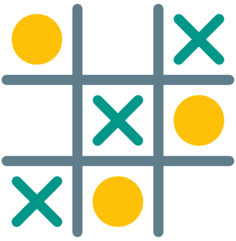
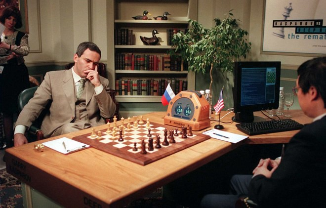
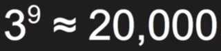
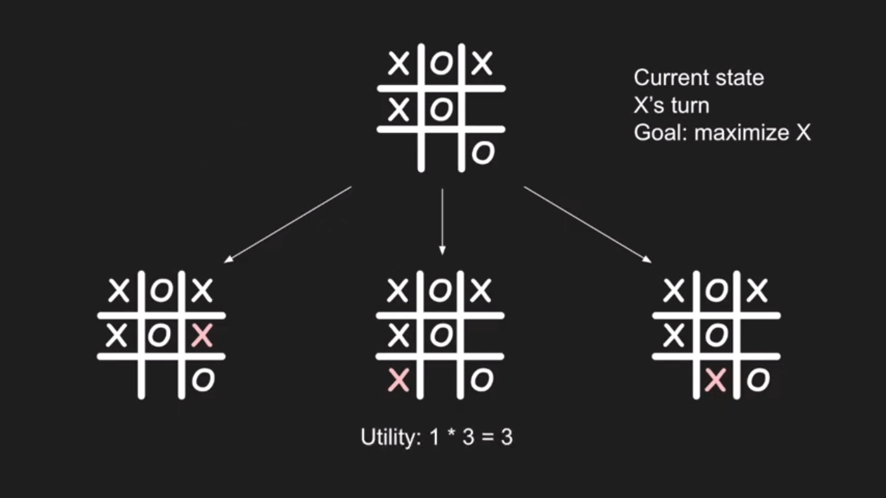

# tic-tac-toe-minimax
tic-tac-toe-minimax is a c++ console application for teaching the computer how to play tic-tac-toe using minimax AI algorithm.


<p align="center">
	</img>
</p>


## Definition of tic-tac-toe

tic-tac-toe is a game in which two players alternately put Xs and Os in compartments of a figure formed by two vertical lines crossing two horizontal lines and each tries to get a row of three Xs or three Os before the opponent does.


## First Known Use of tic-tac-toe

circa 1866, in the meaning defined above.


## History and Etymology for tic-tac-toe

tic-tac-toe, former game in which players with eyes shut brought a pencil down on a slate marked with numbers and scored the number hit.


## Play tic-tac-toe with computer by using the random method

they are lot of way to play tic-tac-toe with the computer one of them is the random method, when It's the turn of the computer the computer choose from available slots one slot randomly.

### Example of the random method on our code :

The function __getListofChooses__ is a function that return all availables slot that the computer can choose and mark one from It.

And after that the computer choose randomly one of the slot that stored in the class variable __listChooses__ by the function rand(), "rand() % (max - min + 1) + min".


```c++
int computerRandomSlot(char **board, std::vector<int> listChooses){
	listChooses.clear();
	listChooses = getListofChooses(board);

	//decision
	srand(time(NULL));
	return  ( listChooses.at( (rand() % ( (listChooses.size() - 1) + 1)) ) );
}
```

But the random method is an easy method to beat because the computer mark slots just randomly and without any analysing of positions of the game.


## Play tic-tac-toe with computer by using the minimax algorithm

In 1997, a computer named “Deep Blue” defeated reigning world chess champion Garry Kasparov — a defining moment in the history of AI theory.

<p align="center">
	</img>
</p>

The expansive timeframe over which the chess computer problem has been pondered lends credence to the complexity of the solution. Textbooks have been written on the computer chess problem alone, and many strategies varying in complexity have been put to the test. we will focus on one general decision-making strategy used by computers across a variety of strategic games, including chess, checkers, mancala, tic-tac-toe, you name it.

This general strategy is encased in a widely-used algorithm in gaming theory, called the Minimax Algorithm. we will take a brief look at how a computer decides its next move using the Minimax Algorithm, but first we need to define a few things:

### How many prospect on tic-tac-toe

We have three defferent options for each square (across , odd, blank) and we have nine squares
<p align="center">
	</img>
</p>
Now we know that any tic-tac-toe game has a limit number of prospects.

### Explain the minimax algorithm

Mini-max algorithm is a recursive or backtracking algorithm which is used in decision-making and game theory. It provides an optimal move for the player assuming that opponent is also playing optimally.

Soo the computer try all possible move for give us which slot is the best to mark from the utility function.

#### how utility function work:

<p align="center">
	</img>
</p>